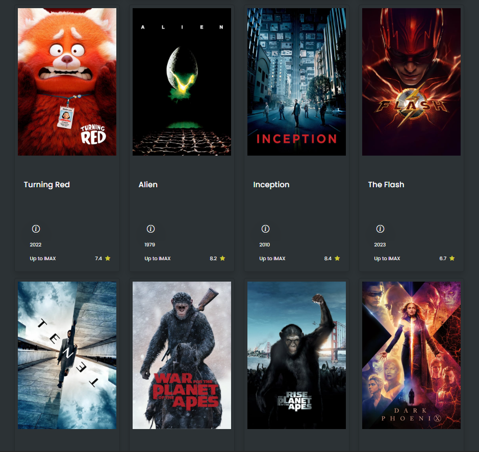
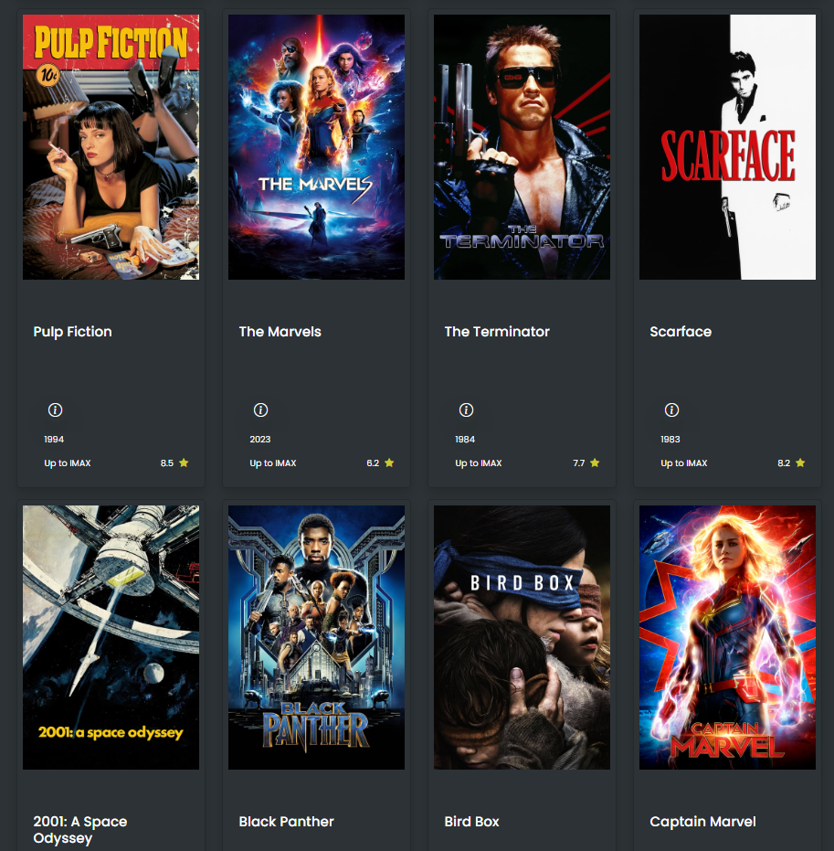

# Documentaion

## About the page
- The page displays different movies according to the inputs of the user.
- All registered movies will be shown right in this pages and enable other users to interact, check out and decide which movie to pick.

## Controller Testing
- A test has been conducted through an api call for different movies. All Movies are placed and displayed in the web page to test
- if the UI is arranged according or somehow near to the expected result.

### API Call

### Server Side Rendering
- This part should not be deleted for future references. This might be helpful when providing actual data from source going to the web page.

## Views Testing
- This parts shows how the data are rendered in the web page.

### Navigation Bar

### Sub-title and Sub-categories

### Main Content

### Main Content Continuation
- Information button can also be hovered which will reveal a modal (See modal below).

### Footer

### Modal

